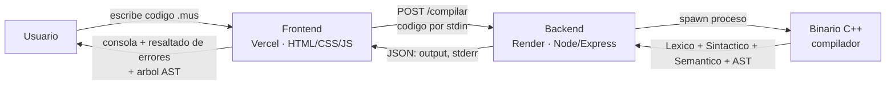

# DSL Musical — Compilador

Compilador para un lenguaje de dominio especifico (DSL) que describe partituras musicales, desarrollado para el curso de **Compiladores** — Universidad Nacional del Altiplano (UNA Puno).

Implementa las 4 fases clasicas de un compilador sobre el DSL:

- **Analisis lexico** — AFD que reconoce palabras clave, notas, duraciones, instrumentos, literales y errores lexicos tipificados (EL1-EL4).
- **Analisis sintactico** — automata de estados con tabla de transiciones (`tTransicion[estado][token]`) y pila de retorno para bloques anidados (`BIS`, `REPETIR`, `SI`).
- **Analisis semantico** — tabla de simbolos con deteccion de variable no declarada, tipo incompatible, redeclaracion y uso antes de inicializar (ES1-ES4).
- **AST** — arbol de sintaxis abstracta generado durante el parseo, visualizable en el frontend.

## Demo en vivo

| | |
|---|---|
| **Frontend** | https://dsl-musical-web.vercel.app |
| **Backend (API)** | https://dsl-musical-web.onrender.com |

> El backend esta en el tier gratuito de Render: si nadie lo usa por 15 minutos se "duerme", y la primera peticion tras eso tarda ~30-50s en responder mientras el contenedor arranca de nuevo. El frontend avisa esto en pantalla si la respuesta tarda.

## Arquitectura



El backend no reimplementa nada del compilador: compila el mismo codigo C++ (`main_web.cpp` + los 4 headers) dentro de un contenedor Docker con `g++`, y lo invoca como proceso hijo por cada peticion, pasandole el codigo fuente por `stdin` y devolviendo su `stdout` tal cual.

## Estructura del repositorio

```
dsl-musical-web/
├── backend/
│   ├── Dockerfile              # instala g++, compila el binario, corre el server
│   ├── server.js               # wrapper Express: POST /compilar -> spawn del binario
│   ├── package.json
│   ├── main_web.cpp            # entrypoint web (lee stdin, sin argv/pausas)
│   ├── analizador_lexico.h
│   ├── analizador_sintactico.h
│   ├── analizador_semantico.h
│   └── ast.h
└── frontend/
    └── index.html              # editor + consola + arbol AST, sin build ni dependencias
```

## Correr en local

**Backend:**
```bash
cd backend
g++ -O2 -std=c++17 -o compilador main_web.cpp
npm install
node server.js
```

**Frontend:** abre `frontend/index.html` directo en el navegador (o `python3 -m http.server` dentro de `frontend/`), y ajusta `BACKEND_URL` en el `<script>` para que apunte a `http://localhost:3000/compilar` si estas probando contra tu backend local.

## Ejemplo de codigo `.mus`

```
HOJA A4
TITULO "Cancion Facil"
AUTOR "Emerson"

PENTAGRAMA 1
CLAVE SOL
COMPAS 4/4
INSTRUMENTO PIANO

DO:NEGRA
RE:NEGRA
MI:NEGRA
SOL:NEGRA |

LA:BLANCA
SI:CORCHEA
DO:CORCHEA
RE:NEGRA |

SOL:BLANCA |
```

## Errores detectados

**Lexicos**

| Codigo | Significado |
|---|---|
| EL1 | Cadena sin cerrar |
| EL2 | Fraccion mal formada (sin denominador) |
| EL3 | Identificador desconocido |
| EL4 | Caracter ilegal |

**Sintacticos** — token inesperado segun la tabla de transiciones, o bloque `BIS`/`REPETIR`/`SI` sin cerrar. Recuperacion en modo panico: sincroniza hasta el proximo `|`, `FIN`, `PENTAGRAMA`, `}` o `FIN_REPETIR`, y retoma desde el dispatcher vigente (evita cascadas de errores falsos tras un solo typo).

**Semanticos**

| Codigo | Significado |
|---|---|
| ES1 | Variable no declarada |
| ES2 | Tipo incompatible (asignacion o condicion de `SI`) |
| ES3 | Redeclaracion de variable |
| ES4 | Uso de variable antes de inicializar |

## Autor

Francy Jimena Ramos Vilca — Ingenieria de Sistemas, UNA Puno
